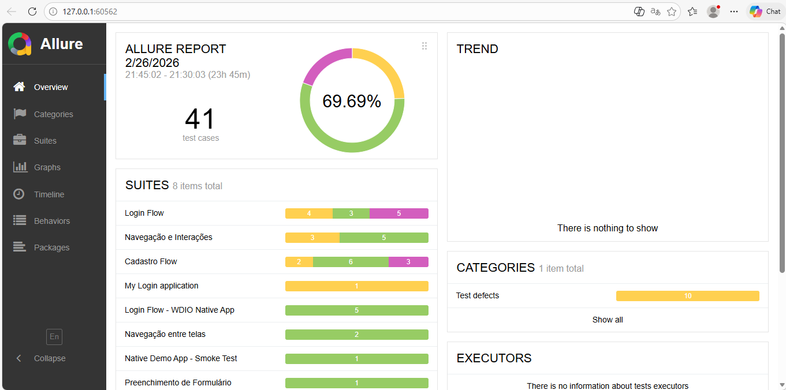
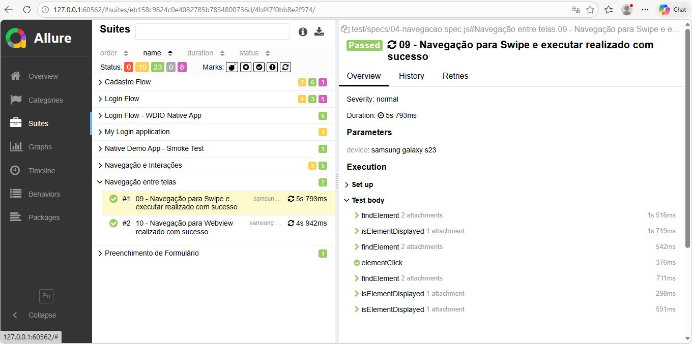

# 📱 Mobile Automation – WebdriverIO + Appium

Mobile automation project developed using the official **WebdriverIO Native Demo App**, following the technical challenge requirements.

---

## 🏗 Technologies Used

- **Language:** JavaScript
- **Test Framework:** WebdriverIO
- **Mobile Automation:** Appium
- **Test Runner:** Mocha
- **Reporting:** Allure Report
- **Cloud Device Platform:** BrowserStack (Android Real Device)
- **Version Control:** GitHub

---

## 📁 Project Structure

mobile-automation-carrefour
├── test/
│ ├── specs/
│ └── pages/
├── apps/
├── wdio.conf.js (Android Local Emulator)
├── wdio.browserstack.conf.js (Android Real Device - BrowserStack)
├── wdio.ios.conf.js (iOS Simulator)
└── package.json

---

## ✅ 1. Test Script Implementation

The project includes test scenarios covering the main application features:

### 🔐 Authentication (Login / Sign Up)
- Successful login
- Invalid login validation
- Error message validation
- User registration

### 📄 Forms
- Field input interactions
- Button actions
- Validation message checks

### 🔄 Navigation
- Screen navigation
- Horizontal swipe
- Vertical swipe
- Drag & Drop interaction

### 🧱 Architecture
- Page Object Model (POM) pattern implemented
- Clear separation of responsibilities
- Organized test suites (Smoke / Regression)
- Retry strategy for cloud stability

---

## 🌍 2. Execution in Different Environments

### 🤖 Android – Local Emulator

npm run wdio

Runs the tests on a local Android emulator using Appium.

---

### 🤖 Android – Real Device (BrowserStack)

npm run browserstack

Configured to run on:

- Samsung Galaxy S23
- Android 13
- Real device in the cloud
- Network logs enabled
- Console logs enabled
- Automatic screenshots on failure

---

### 🍏 iOS – Simulator

The project is configured to run on **iOS Simulator** using the official build provided in the WebdriverIO repository.

⚠️ Important:

The official WebdriverIO Native Demo App states:

> The iOS app can ONLY be installed on iOS simulators.  
> There is no build available for physical iOS devices due to Apple security limitations.

To run iOS tests:

npm run ios

Requirements:

- macOS
- Xcode installed
- iOS Simulator configured

---

## 📸 3. Test Evidence & Reporting

The project includes:

- 📊 Allure Report integration
- 📸 Automatic screenshots on failure
- 📜 Execution logs
- 🌍 Environment information

To generate the report:

allure serve allure-results

The report contains:

- Test execution summary
- Passed / Failed status
- Execution duration
- Failure screenshots
- Detailed logs

---

## 📸 4. Allure Report Preview

### Test Overview

### Test Details

---

## 🔁 5. Test Execution Strategy

### Smoke Suite

Critical tests only:

wdio run ./wdio.browserstack.conf.js --suite smoke

---

### Regression Suite

Full test suite:

wdio run ./wdio.browserstack.conf.js --suite regression

---

## 🔄 Retry Strategy

Cloud execution includes anti-flaky configuration:

- Spec file retry
- Retry delay
- Controlled timeouts

Ensuring stability during real device execution.

---

## 🚀 6. CI/CD Ready

The project structure is prepared for CI/CD integration using:

- GitHub Actions or
- GitLab CI/CD

CI pipeline can:

- Run tests on every commit
- Generate Allure artifacts
- Integrate with BrowserStack

---

## 📦 Application Used

WebdriverIO Native Demo App  
https://github.com/webdriverio/native-demo-app

---

## 📈 Technical Highlights

This project demonstrates:

- Scalable automation architecture
- Cross-platform configuration
- Real device cloud execution
- Professional reporting
- Organized test strategy
- CI/CD readiness

---

## 👨‍💻 Author

Renato de Souza Lima  
QA Automation Engineer